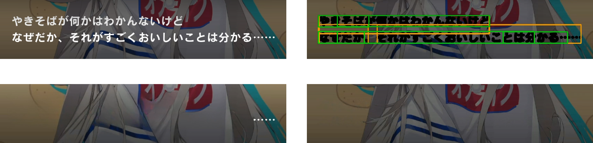

# Video Subtitle Remover：精细字幕 Mask 优化

[](LICENSE)


[](https://hub.docker.com/r/eritpchy/video-subtitle-remover)

> 本项目是 [Video-subtitle-remover (VSR)](https://github.com/YaoFANGUK/video-subtitle-remover) 的一个 fork。主要针对 2D 动画、手游剧情视频等特定类型的视频进行了优化，可能不适用于所有视频场景。

## 项目简介

本项目在原项目的 OCR 字幕检测和视频重绘流程基础上，增加了更精细的字幕 Mask 生成与预览功能，主要包括：

- **精细字幕识别**：原项目会直接对 OCR 检测框生成矩形 Mask，重绘时可能丢失较多背景细节。本项目针对**字幕颜色与背景颜色存在明显差异**的场景，在 OCR 检测框内部进一步进行基于像素颜色的字幕判别，生成更贴合字幕轮廓的精细 Mask。
- **OCR 漏检修复**：OCR 对省略号、问号、叹号、破折号等符号的识别效果可能较差。本项目支持对 OCR 检测框向上、下、左、右扩展，以尝试捕捉 OCR 未覆盖的字幕像素。
- **字幕识别预览**：在正式进行视频重绘前，可以输出将 Mask 区域涂黑的视频，用于检查字幕检测范围并调整参数。
- **基于精细 Mask 的字幕去除**：在原项目的视频重绘流程中使用精细 Mask，支持 `sttn-det`、`lama` 和 `propainter` 模式。

根据目前的测试，LAMA 在部分场景下的效果有较明显提升；ProPainter 在部分情况下可能残留字幕伪影；STTN 尚未测试。

## 适用范围

本项目更适合同时满足以下条件的视频：

- **背景包含较多细节**，例如精细的 2D 人物立绘，或画面变化不剧烈的场景图像；
- **字幕颜色与背景颜色存在明显差异**。

如果字幕颜色接近背景，精细 Mask 的识别效果可能不如原项目的矩形 Mask。例如，白色字幕带黑色描边、且背景中存在大面积白色区域时，像素颜色判别可能难以准确区分字幕与背景。此外，目前精细 Mask 仅支持设置一种字幕主体颜色，不适用于同一视频中存在多种字幕颜色的情况。

若视频不满足上述条件，建议优先使用原项目的字幕去除流程。

## 效果演示



- **左上：带字幕原图**；
- **右上：字幕识别结果预览**。绿色框为原项目 OCR 检测框，橙色框为本项目进行漏检修复后的扩展框，涂黑区域为最终生成的字幕 Mask；
- **左下：原项目使用矩形 Mask 的 LAMA 去字幕结果**；
- **右下：本项目使用精细化 Mask 的 LAMA 去字幕结果**。

## 使用方法

### 安装

请参考原项目的安装说明。

### 1. 预览字幕识别结果

正式去除字幕前，建议先使用约 10 秒的短视频测试字幕检测效果。预览程序会将检测到的 Mask 区域涂黑，并输出预览视频：

```bash
python -m backend.tools.subtitle_mask_video "./yourinput.mp4"
```

预览结果可以帮助判断：

- 字幕是否被完整覆盖；
- 是否误覆盖了背景；
- OCR 检测框扩展是否足够；
- 当前字幕颜色和容差参数是否合适。

### 2. 调整字幕 Mask 参数

所有精细 Mask 相关参数都位于 `subtitle_mask_config.ini`。调参的目标是让生成的 Mask **完整覆盖字幕，同时尽量避免覆盖无关背景**。部分关键参数如下：

#### 视频输入

- `input`：仅供字幕预览脚本使用的视频输入路径。设置后，运行预览命令时可以省略输入路径。
- `duration_seconds`：仅处理视频开头的指定秒数，便于快速测试；设置为 `0` 表示处理完整视频。

#### OCR 参数

- `areas`：OCR 字幕检测区域。区域外不会执行字幕检测；支持配置多个区域。
- `thresh`：文本像素概率阈值。降低该值通常可以减少字幕漏检，但可能增加 OCR 误检。
- `box_thresh`：文本框平均置信度阈值。降低该值通常可以减少字幕漏检，但可能增加 OCR 误检。

最终的精细 Mask 还会根据 OCR 检测框内部的像素颜色进行筛选，因此 OCR 误检不一定会直接导致最终 Mask 误检。对于容易漏检的字幕，可以适当降低 `thresh` 和 `box_thresh`。

#### 基于像素颜色的字幕检测

字幕通常包含主体颜色和边缘过渡颜色。视频压缩等因素可能使边缘颜色与主体颜色存在较大差异，因此使用不同的容差分别判断主体和边缘像素：

- `color`：字幕主体颜色，格式为 `R,G,B` 或 `#RRGGBB`；
- `core_tolerance`：主体颜色判别阈值；
- `edge_tolerance`：边缘过渡区域的颜色判别阈值；
- `max_channel_spread`：近似灰度约束，仅适用于黑白字幕。设置为 `-1` 可关闭该约束，以检测彩色字幕。

对于带描边的字幕，边缘颜色判别的作用可能有限。可以尝试将 `edge_tolerance` 设置为与 `core_tolerance` 相同，并通过调整 Mask 膨胀参数覆盖描边区域。

#### Mask 膨胀

像素颜色检测生成的初始 Mask 可能无法完全覆盖字幕边缘，尤其是存在描边、抗锯齿或半透明像素时，可以使用以下参数扩大最终 Mask：

- `dilation_size`：Mask 膨胀所使用的结构元素尺寸。设置为 `0` 可关闭膨胀；常用值为 `3~5`。数值越大，Mask 向外扩展的范围越大，但也越容易覆盖背景。
- `dilation_iterations`：Mask 膨胀的重复次数。设置为 `0` 可关闭膨胀；数值越大，Mask 通常会进一步扩大。

建议先调整 `dilation_size`，再根据预览结果调整 `dilation_iterations`。

#### OCR 检测框扩展

对于省略号、破折号等细小或孤立字符，OCR 检测框可能无法完整覆盖。以下参数用于在 OCR 检测框附近搜索可能漏检的字幕像素：

- `box_expand_step`：每次向四个方向扩展的带状区域宽度，单位为像素；
- `box_expand_max_x`：单个 OCR 框在左右方向的最大扩展像素数；
- `box_expand_max_y`：单个 OCR 框在上下方向的最大扩展像素数。

#### 时序优化

- `future_mask_frames`：将后续指定帧的 Mask 合并到当前帧，适合字幕逐渐淡入的场景。数值过大可能会提前引入下一句字幕的mask。

### 3. 执行字幕去除

调出较理想的 Mask 预览效果后，确认配置文件中的精细 Mask 开关已打开：

```ini
[integration]
use_refined_mask = true
```

如果希望在正式重绘时同时输出 Mask 涂黑预览视频，可以设置：

```ini
write_mask_preview = true
```

然后执行视频重绘：

```powershell
python backend/main.py `
  --input "yourinput.mp4" `
  --output "youroutput.mp4" `
  --inpaint-mode lama `
  -r 0.7667 0.8944 0.0583 0.3500 `
  -r 0.7667 0.8944 0.3100 0.6200 `
  -r 0.7667 0.8944 0.5800 0.8573
```

说明：

- `-r` 用于指定字幕区域，坐标顺序为 `ymin ymax xmin xmax`，取值范围为 `0~1`；
- 可以通过多次传入 `-r` 指定多个字幕区域；
- 正式去除字幕时，字幕区域必须通过命令行手动传入，修改 `subtitle_mask_config.ini` 中的 `areas` 不会影响正式去除流程；
- 目前推荐优先尝试 `lama`。ProPainter 在部分场景下可能残留字幕伪影，STTN 尚未测试；
- 如果关闭 `use_refined_mask`，流程会回退到原项目的 OCR 矩形 Mask。

## 局限性

本 fork 中新增代码由 GPT-5.6 辅助生成，仅供个人项目使用。新增功能主要面向特定视频类型，泛用性有限，部分功能有待完善。实际效果会受到字幕样式、背景复杂度和画面运动等因素影响。

